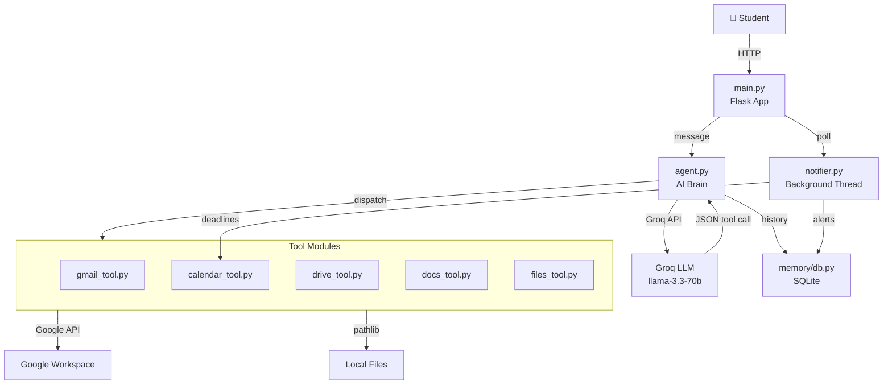

# SchoolAgent — Walkthrough

> Full implementation of the [PLAN.md](file:///home/dadarzz/Desktop/AgenticV2/PLAN.md) across all 5 build phases.

---

## Architecture Overview



---

## How the Tool-Calling Loop Works

The agent uses a **detect → dispatch → re-prompt** loop:

1. User sends a message → `agent.run()` builds prompt with system instructions + history
2. Groq responds with either **plain text** or a **JSON tool call**
3. [parse_tool_call()](file:///home/dadarzz/Desktop/AgenticV2/agent.py#127-147) detects JSON → [dispatch_tool()](file:///home/dadarzz/Desktop/AgenticV2/agent.py#149-181) routes to the correct module
4. Tool result is fed back to the AI as a follow-up message
5. AI generates a final human-readable response
6. Exchange saved to SQLite history

```
User: "/email tell mr. hasan i'll be late"
  → agent.py detects /email shortcut → adds hint to prompt
  → Groq returns: {"tool": "gmail", "action": "draft", "params": {...}}
  → gmail_tool.draft() creates draft in DB
  → Result fed back to AI → "I've drafted your email! Preview it above."
```

---

## Files Changed

### Core

| File | Lines | What it does |
|------|-------|-------------|
| [main.py](file:///home/dadarzz/Desktop/AgenticV2/main.py) | 210 | Flask app: routes, sessions, setup wizard, OAuth, settings, log export |
| [agent.py](file:///home/dadarzz/Desktop/AgenticV2/agent.py) | 260 | AI brain: system prompt, tool-calling loop, dispatch, history, PDF extraction |
| [db.py](file:///home/dadarzz/Desktop/AgenticV2/memory/db.py) | 249 | SQLite: users, history, activity_log, notifications, email_drafts (pre-existing) |

### Tools

| File | Lines | Actions |
|------|-------|---------|
| [gmail_tool.py](file:///home/dadarzz/Desktop/AgenticV2/tools/gmail_tool.py) | 120 | [draft](file:///home/dadarzz/Desktop/AgenticV2/tools/gmail_tool.py#43-61), [send](file:///home/dadarzz/Desktop/AgenticV2/tools/gmail_tool.py#63-89), [read_inbox](file:///home/dadarzz/Desktop/AgenticV2/tools/gmail_tool.py#104-139) |
| [calendar_tool.py](file:///home/dadarzz/Desktop/AgenticV2/tools/calendar_tool.py) | 220 | [create_event](file:///home/dadarzz/Desktop/AgenticV2/tools/calendar_tool.py#81-132), [list_events](file:///home/dadarzz/Desktop/AgenticV2/tools/calendar_tool.py#134-173), [find_deadlines](file:///home/dadarzz/Desktop/AgenticV2/tools/calendar_tool.py#175-209), [delete_event](file:///home/dadarzz/Desktop/AgenticV2/tools/calendar_tool.py#211-242) |
| [drive_tool.py](file:///home/dadarzz/Desktop/AgenticV2/tools/drive_tool.py) | 200 | [list_files](file:///home/dadarzz/Desktop/AgenticV2/tools/drive_tool.py#49-77), [search_files](file:///home/dadarzz/Desktop/AgenticV2/tools/drive_tool.py#79-103), [upload_file](file:///home/dadarzz/Desktop/AgenticV2/tools/drive_tool.py#105-140), [download_file](file:///home/dadarzz/Desktop/AgenticV2/tools/drive_tool.py#142-167), [delete_file](file:///home/dadarzz/Desktop/AgenticV2/tools/files_tool.py#116-136), [share_file](file:///home/dadarzz/Desktop/AgenticV2/tools/drive_tool.py#191-217) |
| [docs_tool.py](file:///home/dadarzz/Desktop/AgenticV2/tools/docs_tool.py) | 230 | [read_doc](file:///home/dadarzz/Desktop/AgenticV2/tools/docs_tool.py#88-116), [edit_doc](file:///home/dadarzz/Desktop/AgenticV2/tools/docs_tool.py#118-152), [create_doc](file:///home/dadarzz/Desktop/AgenticV2/tools/docs_tool.py#154-185), [read_sheet](file:///home/dadarzz/Desktop/AgenticV2/tools/docs_tool.py#187-214), [edit_sheet](file:///home/dadarzz/Desktop/AgenticV2/tools/docs_tool.py#216-246), [create_sheet](file:///home/dadarzz/Desktop/AgenticV2/tools/docs_tool.py#248-275) |
| [files_tool.py](file:///home/dadarzz/Desktop/AgenticV2/tools/files_tool.py) | 160 | [create_file](file:///home/dadarzz/Desktop/AgenticV2/tools/files_tool.py#49-65), [read_file](file:///home/dadarzz/Desktop/AgenticV2/tools/files_tool.py#67-89), [move_file](file:///home/dadarzz/Desktop/AgenticV2/tools/files_tool.py#91-114), [delete_file](file:///home/dadarzz/Desktop/AgenticV2/tools/files_tool.py#116-136), [list_dir](file:///home/dadarzz/Desktop/AgenticV2/tools/files_tool.py#138-163), [create_dir](file:///home/dadarzz/Desktop/AgenticV2/tools/files_tool.py#165-179) |

### Notifications

| File | Lines | What it does |
|------|-------|-------------|
| [notifier.py](file:///home/dadarzz/Desktop/AgenticV2/notifications/notifier.py) | 100 | Background thread checks deadlines every 15min, stores alerts in SQLite |

### Frontend

| File | Lines | What it does |
|------|-------|-------------|
| [index.html](file:///home/dadarzz/Desktop/AgenticV2/templates/index.html) | 115 | Chat UI: sidebar, shortcut chips, file upload, email modal, toasts |
| [setup.html](file:///home/dadarzz/Desktop/AgenticV2/templates/setup.html) | 130 | 4-step setup wizard with API key test |
| [log.html](file:///home/dadarzz/Desktop/AgenticV2/templates/log.html) | 85 | Activity log table with filters + CSV export |
| [settings.html](file:///home/dadarzz/Desktop/AgenticV2/templates/settings.html) | 95 | Update key, Google auth, clear history, reset |
| [style.css](file:///home/dadarzz/Desktop/AgenticV2/static/style.css) | 620 | Premium dark/light design system |
| [app.js](file:///home/dadarzz/Desktop/AgenticV2/static/app.js) | 270 | Chat, shortcuts, theme toggle, file upload, notifications polling |

---

## Key Design Decisions

### Simulation Fallback
Every Google tool works in two modes:
- **Real mode** — when a valid Google OAuth token is stored, it calls the actual API
- **Simulation mode** — returns realistic sample data so the app is functional without Google credentials

### Path Safety ([files_tool.py](file:///home/dadarzz/Desktop/AgenticV2/tools/files_tool.py))
All local file operations are restricted to `Path.home()`. The tool:
- Resolves all paths via `pathlib.Path.resolve()`
- Blocks `..` traversal explicitly
- Checks resolved path starts with home directory

### API Key Storage
Keys are base64-encoded before storing in SQLite — not true encryption, but prevents casual exposure. The plan notes using `base64 + a local secret at minimum`.

---

## How to Run

```bash
cd /home/dadarzz/Desktop/AgenticV2
.venv/bin/python main.py
# Open http://127.0.0.1:5000
```

First launch redirects to `/setup` → enter name + Groq API key → optionally connect Google → start chatting.

### Shortcuts
Type these in the chat input or click the chips:
| Shortcut | Tool | Example |
|----------|------|---------|
| `/email` | Gmail | `/email tell mr. hasan i'll be late` |
| `/cal` | Calendar | `/cal add math exam next friday 2pm` |
| `/drive` | Drive | `/drive list my files` |
| `/docs` | Docs/Sheets | `/docs summarize my Biology Notes` |
| `/files` | Local files | `/files create notes.txt in Documents` |
| `/remind` | Deadlines | `/remind what's due soon?` |
| `/ask` | Q&A | `/ask what is osmosis?` (attach PDF) |

---

## Validation Results

All imports and functional tests passed:

```
✅ memory.db imports OK
✅ gmail_tool imports OK
✅ calendar_tool imports OK
✅ drive_tool imports OK
✅ docs_tool imports OK
✅ files_tool imports OK
✅ notifier imports OK
✅ agent imports OK
✅ DB initialized
✅ agent functions exist
✅ parse_tool_call works
✅ files_tool list_dir works
✅ path safety blocks /etc/passwd
✅ path safety blocks traversal
✅ All 9 Flask routes registered
```
